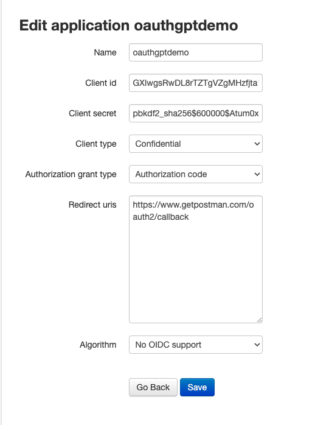

# How to make new oauth app

## Why

As an oAuth server, you need to give different client app their own oAuth credentials.

## How to

Each howto is a pre-requisite for the subsequent howto.

You can do your own way to accomplish the same outcome, but if you're a complete newbie, I recommend you follow exactly.

You can also watch the loom here.

I have compiled the whole thing as a loom video here.

Most of the steps here are inspired by https://django-oauth-toolkit.readthedocs.io/en/latest/tutorial/tutorial_01.html#create-an-oauth2-client-application but sadly their steps are outdated.

Mine is updated as of 2023-12-17 Sunday for django-oauth-toolkit version 2.3.0

### How to new superuser

Objective: to have a superuser for your app

How to tell success: when you have a new user record under `auth_user` table in the database

run `python manage.py createsuperuser`

fill in with a username, password (pls store it somewhere safe), email address (use fake since no email server connected)

### How to make new client app for localhost and get new credentials

Objective: to have a separate client app and credentials for oauth to work

How to tell success: when you have a CLIENT_ID and CLIENT_SECRET auto generated

1. go to http://localhost:8000/admin and login
2. go to  http://localhost:8000/o/applications/
3. fill in the following
Name: oauthgptdemo (give whatever you like)
Client Id: auto generated
Client SEcret: auto generated
Client Type: Confidential
Authorization Grant Type: Authorization code
redirect: https://www.getpostman.com/oauth2/callback
Algo: no oidc support

### How to prepare the postman

craete a new endpoint http://localhost:8000/api/function_based/hello

Go to Authorization tab

Type: oAuth 2.0
Token Name: OAuthGPT Test Token (Give any you like)
Grant Type: Authorization Code
Callback: https://www.getpostman.com/oauth2/callback
Auth URL: http://localhost:8000/o/authorize/
Access Token URL: http://localhost:8000/o/token/

Client ID: <take from previous section>
Client Secret: <take from previous section>

Client Authenticaion: Send as Basic Auth header

Get New Access Token

Get prompted to login and authorize. SO login using the superuser and authorize

Wait for the access token to be done

Select "Use This Token"

### How to